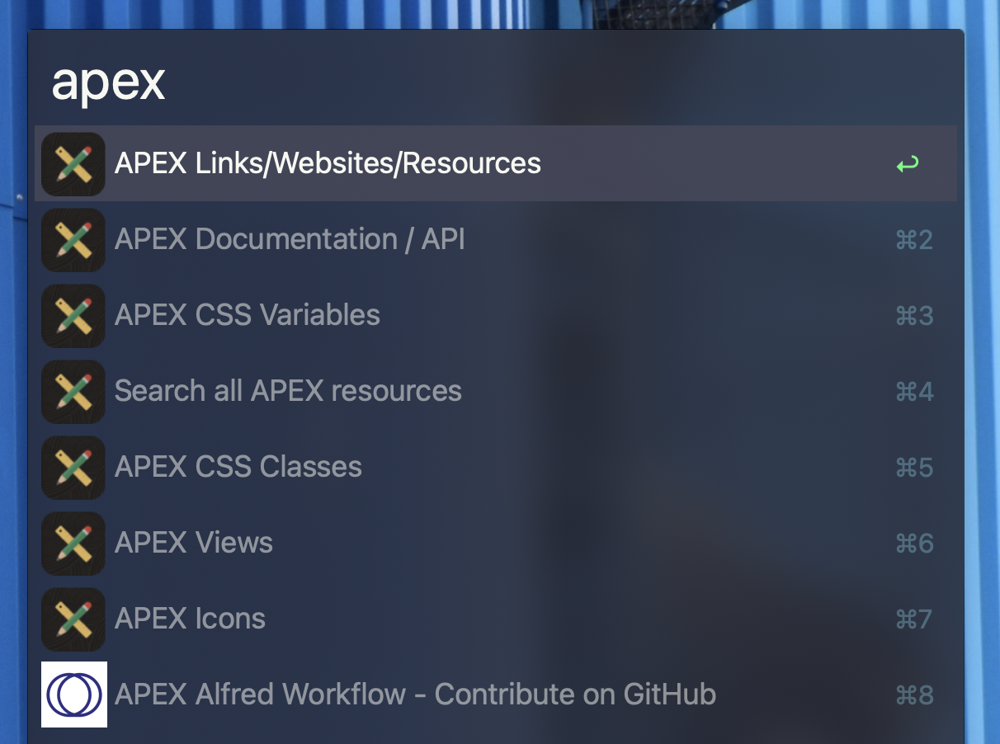

# UC APEX Alfred Workflow

This is an [Alfred](https://alfred.app/) workflow for quickly accessing Oracle APEX related resources. These include:

- API Reference / Documentation (PL/SQL and JS)
- Icons
- Views
- CSS Classes
- CSS Variables
- Useful Links and Websites

## Prerequisites

- [Alfred](https://alfredapp.com) (macOS only)
- [Alfred Powerpack](https://www.alfredapp.com/powerpack/)
- [Node.js](https://nodejs.org/en/) >= v20

**Don't have a Mac or Alfred?** Feel free to fork this repository and create a similar tool for your platform of choice. All the relevant data is stored in the `data` directory.

## Installation

```
npm i -g uc-alfred-orclapex
```

## Usage

Trigger Alfred and write `apex` followed by a space. You can immediately start typing to filter the results.


To search in a specific category, type `apex` and take a look at the available options. Select one and then start typing to filter the results.



## Contributing

Feel free to contribute to this project. You can add new data, fix bugs, or improve the workflow. We may reject changes that don't align with the purpose of this workflow. If you are unsure, please open a discussion first.

### Contribute workflow

- Fork this repository
- Clone your fork
- Make changes
- Create a pull request

### Development

- Clone this repository
- Run `npm install`

Your local workflow is now set up. Any changes you make to the workflow will be reflected in the cloned repository.

**Add data** to the `data` directory. The data is stored in JSON format. Don't manually add data to the json files which have a `.sql` file with the same name. These files are sourced from the database.

The `index.js` and `getOptions.js` have the logic for the workflow. It is basically just loading the JSON files and filtering them based on the user input.

The Alfred workflow is set up that any result will open a browser window if the returned `arg` property is a URL or otherwise write the `arg` out.
